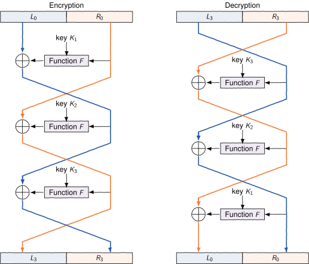
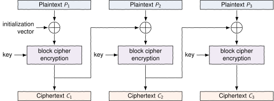
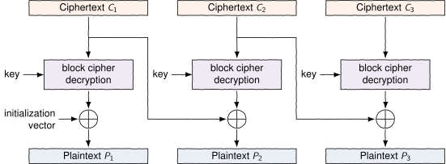

# mooc-cyber-advanced-2023

# 01 Break the Hash

In this exercise you are given a hash and a list of candidate passwords, and
your task is to write a password guesser that finds the password in the candidates that was used to generate the hash.

The hash follows a common format used for storing hashed password

<pre class="language-text"><code class="language-text">procotol$salt$hash</code></pre>

Here, the protocol will always be set to 42, so you can ignore it.
For hashing we will use SHA-384. In this exercise, the hash is constructed by hashing a message containing the salt followed by the actual password.
In practice, the combination of salt and the password is significantly more convoluted.

The salt and the password hash are both base64 encoded in the hash string, and need to be decoded.

<em>Hints:</em>
<ol>
<li>You will find hashlib and base64 libraries useful.</li>
<li>The hash and the candidates are all text strings but the above libraries operate with byte arrays. Use <code class="language-text">encode('utf-8')</code> to get a byte array from a text string.</li>
</ol>

---

# 02 Substitution Cypher

Implement a substitution cipher: complete <code class="language-text">encrypt</code> and <code class="language-text">decrypt</code> functions in <code class="language-text">src/substitution.py</code>.

Both functions are byte arrays and should output an byte array as an output.
The key is an array such that <code class="language-text">key[c]</code> is equal to the <em>encrypted</em> value of <code class="language-text">c</code>.

---

# 03 Repeating Pads

Implement a xorpad cipher: complete <code class="language-text">encrypt</code> and <code class="language-text">decrypt</code> functions in <code class="language-text">src/xorpad.py</code>.
Both functions are byte arrays and should output an byte array as an output.

The pad can be significantly shorter than the message. In such a case you should repeat the pad as long as needed.

Note that repeating short pads is highly problematic, for example, one can
deduce the pad if a short part of message is known in advance (can you figure out how?). Thus, this should not be used in practice.

---

# 04 Frequency Attack

Implement a simple frequency attack against a substitution cipher.
Complete <code class="language-text">decode</code> in <code class="language-text">decode.py</code>. The function is given a string <code class="language-text">ciphertext</code> and dictionary <code class="language-text">frequencies</code>,
where <code class="language-text">frequencies[c]</code> is a float indicating how frequent is the letter.
The output of the function should be a string (not byte array).

You can assume that <code class="language-text">ciphertext</code> and the output do not use capital letters.
Non-characters (spaces, enters) are not changed.

Furthermore, you can assume that the frequency rank in <code class="language-text">frequencies</code> matches
the frequency rank in the message.  That is, the most common letter in
<code class="language-text">frequencies</code> will be the most common letter in the message.

Hint: <code class="language-text">string.ascii_lowercase</code> and <code class="language-text">islower()</code> can be handy.

---

# 05 Feistel Cipher

Feistel ciphers are used as a building blocks in constructing many known block ciphers.

In feistel cipher you are given a block cipher **F** that can encrypt a message of length *m*.
You are also given *n* keys **(K1,...,Kn)**.   

Feistel cipher is a block cipher encrypting messages of *2m*.
At the beginning, original message is split in two halves, *L0* and R0, each of size *m*.
Then *n* iterations are done with updates   

**Li = Ri-1**   
**Ri = Li-1 xor F(Ri-1, Ki)**.   

Here *Li* and *Ri* are the two halves of the ciphertext after ith round.   
The final cipher is *Ln* followed by *Rn*.

The decryption works in similar fashion but in reverse order.
Note that we can rewrite the update equations as

**Ri-1 = Li**   
**Li   = Ri xor F(Ri-1, Ki) = Ri xor F(Li, Ki)**.   

In other words, we can start from *Ln* and *Rn* and reverse all the way back to *L0* and *R0*.   

     

Implement Feistel cipher: complete encrypt and decrypt in <code class="language-text">src/feistel.py</code>.
The function *F* is a class parameter <code class="language-text">self.roundf</code>, and the keys is an array in class parameters <code class="language-text">self.keys</code>.   

You can assume that the block size *m* of *F* is 4.

---

# 06 Cipher Block Chaining (CBC)

Feistel cipher in the previous exercise can only handle blocks of *m = 8*. Next we are going to extend the cipher
to handle messages of any sizes.
We will use cipher block chaining (CBC).

The first step is to make sure that the message length is a multiple of 8.
This is done with PKCS#7 padding. In such padding, message is padded with extra bytes
so that the message length is a multiple of 8. The value of the bytes are equal to the added bytes. If the message length
is already a multiple of 8, then 8 bytes are added with a value of 8. In other words, padding will be one of the
following lines.

<pre class="language-rest"><code class="language-rest">
01
02 02
03 03 03
04 04 04 04 
...</code></pre>

(note that the numbers are byte values not ascii integers)    

The next step is to encrypt the message.
Here the message is divided into blocks of length 8, *P1,P1...*.
We also set *C0 = iv*, where *iv* is an initialization vector, an array of length 8, provided as a parameter.
The encryption proceeds iteratively with

**Ci = encrypt(Pi xor Ci-1)**,

is *encrypt* our block cipher. The final cipher message is *C1C2C3...*. Note that we do not include *C0* here, the initilization vector is sent separately.   

     

To decrypt, note that

**Pi xor Ci-1 = decypt(Ci)**

which we can rewrite

**Pi  = decypt(Ci) xor Ci-1**.   

    

Complete Cbc class by implementing <code class="language-text">encode</code> and <code class="language-text">decode</code>. Remember to add and remove the padding.
Note that you will also need the fully-implemented Feistel class from the previous exercise.

Hint: you will probably find the xor helper function helpful. Do not forget add the pad even if the message length is already a multiple of 8.

---

# 07 Oracle Padding Attack

Implement padding oracle attack by completing the functions <code class="language-text">test_value</code> and <code class="language-text">decode_block</code>.

The function <code class="language-text">test_value(b1, b2, index, oracle)</code> finds out which values of <code class="language-text">b1[index]</code> will produce a valid padding.
Use <code class="language-text">oracle.isvalid</code> to test the ciphertexts. If there are multiple values with valid padding, then <code class="language-text">test_value</code>
should select one of the values by modifying <code class="language-text">b1[index - 1]</code>.

The function <code class="language-text">decode_block(b1, b2, oracle)</code> should decrypt the second block by manipulating <code class="language-text">b1</code> and using <code class="language-text">test_value</code>.

You will need to copy your implementations of Feistel cipher and Cbc class.

<em>Hints:</em>
<ol>
<li>There is a lot of xorring here, be careful and perhaps spend some time with pen and paper.</li>
<li>When solving 7, 6, 5, ... bytes of the block make sure that you setup the trailing padding bytes correctly.</li>
<li>Don't forget that ultimately we are looking for P2 not A
</ol>

---

# 08 Man In The Middle

Certificates are needed to prevent man in the middle attacks. In this exercise we will create a
man-in-the-middle server that capitalizes every letter of the HTML page. You should
capitalize the output only if the server responses with HTML.

The template contains a simple web server that connects simply shows the page address and nothing else.
Modify the server so that it pretends to be the server given in
<code class="language-text">self.remote_address</code> but capitalizes every letter in the response.

You should at least match response code, content, and content type.

You can test the server manually with

<pre class="language-sh"><code class="language-sh">python3 mitm.py 8000 target_domain</code></pre>

and by going to <code class="language-text">http://localhost:8000</code>. Do not forget to add <code class="language-text">http://</code> or <code class="language-text">https://</code> in the <code class="language-text">target_domain</code>.

You can use an external target or you can start your own local target by launching a target server with

<pre class="language-sh"><code class="language-sh">python3 -m http.server 9000</code></pre>

in the <code class="language-text">server</code> folder.
This will start the target server at port 9000 and

<pre class="language-sh"><code class="language-sh">python3 mitm.py 8000 http://localhost:9000</code></pre>

in the <code class="language-text">src</code> folder
will start a man-in-the-middle server at 8000.

Note that you can use https website as a target as well. The visible difference
here is that the browser will not show that the displayed website is secure.

<em>Hints:</em>
<ol>
<li>Make sure to use both <code class="language-text">self.remote_address</code>  and <code class="language-text">self.path</code>.</li>
<li>Requests library is your friend.</li>
<li>You don't need to parse HTML. You can simply capitalize every letter in response (use <code class="language-text">upper()</code>).
This will certainly break certain pages, especially with javascript code.
Fancier approach would be to parse HTML with beautifulsoup but it is not needed for this exercise.</li>
</ol>

---

